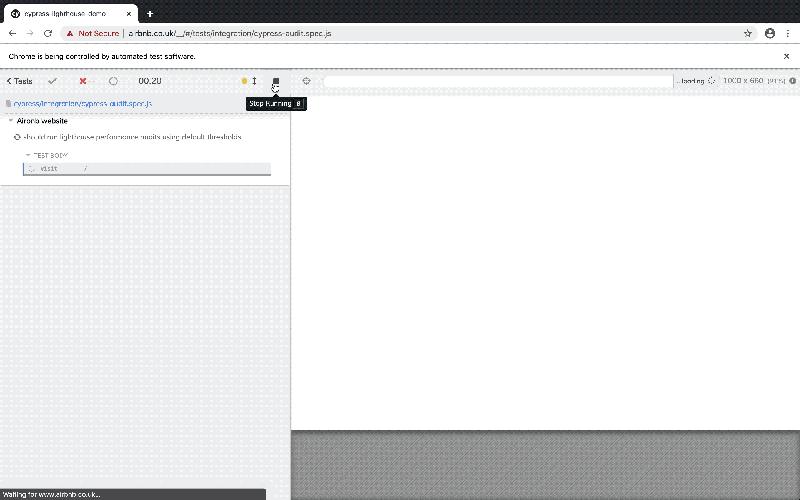

# Cypress-audit

Yes, you can extend Cypress to cover web page performance!

Cypress-audit is a custom plugin, created by [Marvin Frachet](https://github.com/mfrachet), lets you leverage the existing Cypress tests you have and introduces additional commands to check the performance of any pages you want.

