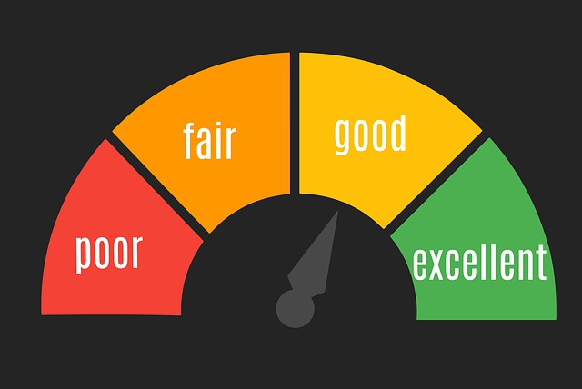

# Performance metrics (Lighthouse 6.0)

Explanations of some performance metrics. For more information, please check out [Lighthouse 6 Performance Scoring](https://web.dev/performance-scoring/#lighthouse-6)

1. **First Contentful Paint (FCP)** - FCP measures how long the browser renders the first piece of DOM content after a user navigates to your page.
2. **Large Contentful Paint (LCP)** - LCP measures how long the browser renders the largest piece of DOM content (image or text block) after a user navigates to your page.
3. **Speed Index** - measures how long the content visually loads on page load.
4. **Time to Interactive (TTI)** - TTI measures how long the page can become fully interactive.
5. **Total Blocking Time (TBT)** - TBT measures the time the page is blocked from responding to user inputs. Anything that executes above 50ms is considered a blocking task.
6. **Cumulative Layout Shift (CLS)** - CLS measures the visual stability of your page.
