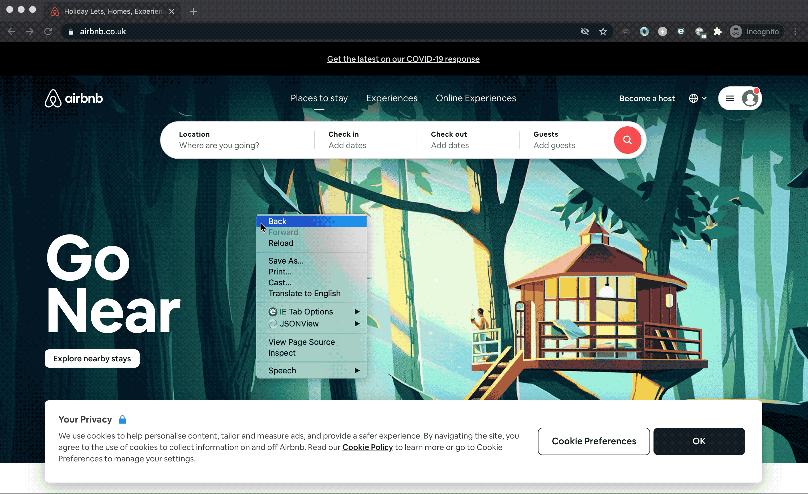

# Performance Testing

- back end/server side
- front end/client side

**Test for multiple concurrent users as well as single user.**

# Google Lighthouse

## Running Google Lighthouse

- Chrome DevTools
- Browser extension
- [Lighthouse CLI](https://github.com/GoogleChrome/lighthouse#using-the-node-cli)
- [Cypress-audit](https://github.com/mfrachet/cypress-audit)
